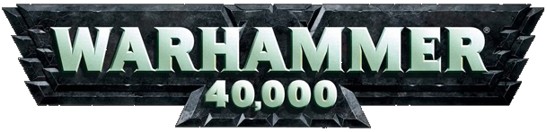

# Warhammer 40,000

The objective of this webpage is to provide an introduction to the Warhammer 40,000 universe along with an introduction to some of the original factions.
As the warhammer 40,000 universe has a huge rich background of lore and factions it can be quite daunting for new players, collectors and readers to pick 
up.
The idea behind this website is to create an introduction for people interested in Warhammer 40,000 without overloading them with information and still 
providing the means to gain access to any further information that they might want, this will help to drive traffic towards games workshop's other websites 
as well as social media pages and in turn drive up sales.

### UX

The website is aimed at people who have an interest in the Warhammer 40,000 universe weather it is collecting, painting and/or playing the various games set 
in the universe or the novels and background itself which interests them, the universe is a huge and daunting thing to get in to and it may be difficult for
new players to find where to start.
This website would be used as an introduction to the Warhammer 40,000 universe as well as an introduction to some of the classic factions providing a portal
to the various Games workshop websites so users can easily find their way to the content that they are looking for.
Without going too deeply in to the sub factions that belong to the many factions of the Warhammer 40,000 universe this project provides introductory
information to give users an idea of the background without overloading them with infromation but also provides them with the means to find the information
that they are most interested in.

### User Stories

#### Collector/Player user type
As a collector, I want to find information on the different factions, so that I can make a decision on which models to buy.

#### Fiction reader user type
As a reader of science fiction, I want to discover more about the setting, so that I can decide if I am interested in the fictional stories and characters.

#### New to Games Workshop user type
As someone who has never heard of Warhammer 40,000 before, I want to find out about the universe in easy to understand bitesize chunks, so that I can decide
if this is something that interests me.

#### Wireframes

Below are my first drafted ideas of how the page would look and work, these were originally made using WireframeSketcher.

- [Home Page on Desktop](assets/wireframes/desktophome.png)
- [Home Page on Mobile](assets/wireframes/mobilehome.png)
- [Open Modal](assets/wireframes/modals.png)
- [Open Collapse on Mobile](assets/wireframes/opencollapse.png)

### Features

#### Navbar

The Navbar used in this project was taken from Bootstraps library and then styled with CSS, some of the list items were reordered and an additional one 
was added to match the layout of the page. The navbar is fixed so that a user can move to any part of the page from anywhere on the page and is styled to 
be opaque so that it doesn't get in the way.

#### Introduction Video

Using a Bootstrap embed this video was taken from Warhammer TV, Games Workshop's youtube channel, it is placed at the top of the page as a way to catch the
users attention and build some interest and insight in to the setting. As the video is quite large, on smaller screens it is replaced by an image instead.

#### Introduction Text

As this is a large block of text it includes an image to break up the information, one block is to set the scene while the other speaks about the hobby 
itself.
On smaller screens this information is placed within a collapse, which was taken from bootstrap and the button to open and close it was taken from
font Awesome, so there isn't too much information on the screen for a user and the text can be collapsed away once finished with. The collapse uses
Bootstraps Jquery.

#### Factions

To provide an introduction to some of the factions in the Warhammer 40,000 universe there are four images, one of a Space Marine, Chaos Space Marine, Ork
and Asuryani, which have been included as they are some of the original factions for the game and it also gives users an idea of how these factions look.
The images have been made responsive so that on mobile they stack one on top of the other to keep the characters standing apart, allowing them to be larger
and draw attention to themselves seperate from the others.
On larger screens these images are accompanied by text that gives some background information on each faction, their themes and where they stand in the 
universe.

##### Modals
On smaller screens the faction information has been made responsive and will no longer display on the page, instead selecting the image for each faction 
will open up a modal which has been taken from Bootstrap and styled with CSS, this allows the text to be hidden away and only displayed when the user
wishes to read it rather than taking up too much space on the screen.

#### Newsletter Sign Up

Appearing at the bottom on all screen sizes is a call to sign up to a Newsletter, selecting the letter image which was taken from Font Awesome will open up
a modal which was taken from Bootstrap and styled with CSS, Within this modal is a form that was also taken from Bootstrap prompting the user to enter their
email address. The email has been set to required so pressing the submit button without entering anything will display a error message, as will entering an
invalid email address.
For the purposes of this project the collected inforation is not saved anywhere.

#### Possible Features to Implement

- A which faction suits you style questionair that goes through a series of questions on style and combat types and leads users to a suggested faction that suits them based on their answers - This would require Javascript.
- A carousel of images that shows some of the key units for different factions that could catch users eyes, clicking the image would take them through to the product on www.games-workshop.com

### Technologies Used

- This project uses **HTML** and **CSS** programming languages
- [**Cloud9**](https://c9.io) was used as the development IDE
- [**BootstrapCDN**](https://getbootstrap.com/) was used to make the layout and responsiveness of the page easier
- BootstrapCDN's [**FontAwesome**](https://fontawesome.com/) was also utilised to provide icons for things such as social media, the Newsletter icon and the collapse icon
- [**Bootstrap's Library**](https://getbootstrap.com/) was used to provide pieces of code that formed the basis of the collapse, modals, Newsletter sign up form and the embed for the iframe which holds the YouTube video
- [**Google Fonts**](https://fonts.google.com/) was used to provide the font "Teko" throughout the page
- [**JQuery**](https://jquery.com/) was used to provide the Javascript code required for the collapse, responsive Navbar and modals
- [**Popper.js**](https://popper.js.org/) was also used for the responsive navbar
- this projects wireframes were created on [**WireFrameSketcher**](https://wireframesketcher.com/)
- The HTML and CSS code were validated using the [**W3C Markup Validation Service**](https://validator.w3.org/) website

## Testing

### User Stories Tested

#### Collector/Player user type
**As a collector, I want to find information on the different factions, so that I can make a decision on which models to buy.**

1. Arrive at home page
2. Scroll through information and read about the setting and hobby 
    * (Mobile) Scroll to the collapse button and open the collapse
    * (Mobile) Read about the setting and hobby
    * (Mobile) Close the collapse with the button at the bottom of the text
3. Scroll to the factions section
4. Read information on each faction
    * (Mobile) Select an image to open the modal and read the faction information
5. Scroll down and decide to sign up to the Newsletter
6. Click on the Letter icon to open the email submission modal
7. enter email address and click Submit
8. scroll further down to the other website links and read the information there
    * (Mobile) Scroll down to the other website links
9. Select www.games-workshop.com to visit to find out more information on one of the four specific factions or discover the other factions

#### Fiction reader user type
**As a reader of science fiction, I want to discover more about the setting, so that I can decide if I am interested in the fictional stories and characters.**

1. Arive at home page
2. Watch Youtube video to get an initial idea of the setting
3. scroll down to the introduction and read about the setting
    * (Mobile) Scroll to the collapse button and open the collapse
    * (Mobile) Read about the setting
    * (Mobile) Close the collapse with the button at the bottom of the text
4. Scroll to the factions section
5. Read information on each faction
    * (Mobile)  Select an image to open the modal and read the faction information
6. Scroll down and decide to sign up to the Newsletter
7. Click on the Letter icon to open the email submission modal
8. enter email address and click Submit
9. Scroll to the other website links and read the information there
    * (Mobile) Scroll down to the other website links
10. Decide that the Black library website suits your needs as a user interested in science fiction and select that website

#### New to Games Workshop user type
**As someone who has never heard of Warhammer 40,000 before, I want to find out about the universe in easy to understand bitesize chunks, so that I can decideif this is something that interests me.**

1. Arrive at home page
2. Watch YouTube video to get an idea of the setting
3. Scroll down to the introduction and read about the setting and hobby
    * (Mobile) Scroll to the collapse button and open the collapse
    * (Mobile) Read about the setting and hobby
    * (Mobile) Close the collapse with the button at the bottom of the text
4. Scroll to the faction section
5. Read information on each faction
    * (Mobile) Select an image to open the modal and read the faction information
6. Scroll down and decide to sign up to the Newsletter
7. Click on the Letter icon to open the email submission modal
8. enter email address and click Submit
9. scroll further down to the other website links and read the information there
    * (Mobile) Scroll down to the other website links
10. Decide which website suits what you are looking for and select that website

### Features Testing

#### Navbar

** Desktop **
1. Go to home page
2. Select Introduction to see that the page scrolls smoothly to the introduction section
3. Select Warhammer 40,000 to see that the page scrolls smoothly to the top of the page
4. select factions to drop down the menu
5. Select Space Marines to see that the page scrolls smoothly to the Space Marine faction information
6. Select Warhammer 40,000 to see that the page scrolls smoothly to the top of the page
7. Select factions to drop down the menu
8. Select Chaos Space Marines to see that the page scrolls smoothly to the Chaos Space Marine faction information
9. Select Warhammer 40,000 to see that the page scrolls smoothly to the top of the page
10. Select factions to drop down the menu
11. Select Asuryani to see that the page scrolls smoothly to the Asuryani faction information
12. Select More Info to see that the page scrolls down to the footer of the page

** Mobile **
1. Go to home page
2. Select Burger icon in top right corner of screen to drop down the menu
3. Select Intoduction to see that the page scrolls smoothly to the Tag line and Introduction Collapse
4. Select Warhammer 40,000 to see that the page scrolls smoothly to the top of the page
5. Select Factions to see that the page scrolls smoothly to the top of the faction images
6. Select More Info to see that the page scrolls smoothly to the Footer of the page

** Responsiveness **
1. Using developer tools (Right click on web page and select Inspect) 
2. Press Ctrl+Shift+M to set the screen to be responsive 
3. Check different sized mobile devices and see that the Burger icon appears in the top right of the Navbar
4. Check Different sized tablet devices and see that on smaller tablets the Burger icon is displayed while in screen elements are displayed like desktop and larger tablets do not have the Burger icon
5. Set the screen as responsive and drag the margin in and out to see where Media queries switch over (max 767px / min 768 px) and the Navbar Burger Icon appears (max 991px)
 
 

Testing
In this section, you need to convince the assessor that you have conducted enough testing to legitimately believe that the site works well. Essentially, in this part you will want to go over all of your user stories from the UX section and ensure that they all work as intended, with the project providing an easy and straightforward way for the users to achieve their goals.

Whenever it is feasible, prefer to automate your tests, and if you've done so, provide a brief explanation of your approach, link to the test file(s) and explain how to run them.

For any scenarios that have not been automated, test the user stories manually and provide as much detail as is relevant. A particularly useful form for describing your testing process is via scenarios, such as:

Contact form:
Go to the "Contact Us" page
Try to submit the empty form and verify that an error message about the required fields appears
Try to submit the form with an invalid email address and verify that a relevant error message appears
Try to submit the form with all inputs valid and verify that a success message appears.
In addition, you should mention in this section how your project looks and works on different browsers and screen sizes.

You should also mention in this section any interesting bugs or problems you discovered during your testing, even if you haven't addressed them yet.

If this section grows too long, you may want to split it off into a separate file and link to it from here.

### Deployment
This section should describe the process you went through to deploy the project to a hosting platform (e.g. GitHub Pages or Heroku).

In particular, you should provide all details of the differences between the deployed version and the development version, if any, including:

Different values for environment variables (Heroku Config Vars)?
Different configuration files?
Separate git branch?
In addition, if it is not obvious, you should also describe how to run your code locally.

Credits---------------------------------------------------------------------------------------------------------------------------------------------

-----------------------------------------Content
The text used in the introductory collapse and faction modals were copied from www.warhammer40000.com

-----------------------------------------Media
The "40klogo.jpg" image was taken from www.themarysue.com
The background image for the page and modals was taken from www.hadi.palmex.co
The "spacemarine.jpg" image was taken from www.warhammer40000.com
The "chaosspacemarine.jpg" image was taken from www.eternalcrusade.com
The "eldar.jpg" image was taken from www.mikemyler.com
The "ork.jpg" image was taken from www.pinterest.com (originl art by albe75.deviantart.com on deviantART)
The "collapse-filler.jpg" image was taken from www.warhammer-community.com
The "gw-logo.jpg" image was taken from the games workshop wiki page (https://en.wikipedia.org/wiki/Games_Workshop)
The "bl-logo.jpg" image was taken from www.warhammer-community.com
The "wh-community.jpg" image was taken from www.40krpgtools.com
The "fw-logo.jpg" image was taken from www.spikeybits.com 
The "replacement.jpg" image was taken from www.warhammer-community.com

Acknowledgements
I received inspiration for this project from X